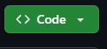
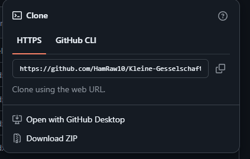
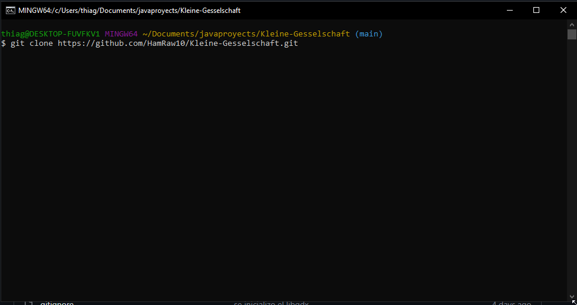
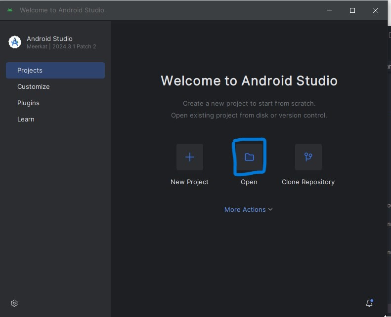
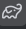
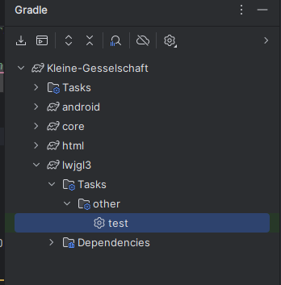

# Kleine-Gesselschaft

## Integrantes
* Castiñeira Thiago
* Gonzalez Maximo
* Rudaz Fabrizio

## Descripcion

El juego se va a llamar “kleine Gesellschaft” y el mismo va a consistir en un mundo abierto donde el personaje pueda interactuar libremente con quienes quiera(que sean jugadores), y realice acciones dentro del juego, ya sea comprar, jugar minijuegos, hacer intercambios, chatear, etc. El mismo además va a poseer monedas, con las cuales va a comprar objetos, mascotas, o también para obtener de las monedas, debería vender objetos de su posesión o jugar determinados minijuegos, y además va a poder realizar si quiere, determinadas misiones con las que va a obtener determinadas recompensas.

## Tecnologias Utilizadas
* LibGdx
* IDE: Android Studio
* KyroNet (todavia no aplicado)

## Como compilar y ejecutar

### Como instalar los archivos
Primero tendremos que descargar los archivos del proyecto, nos iremos al repositorio y clickearemos en donde dice code en verde ().

Ahi nos aparecera una ventana como esta copiaremos el link https con el boton que tiene el siguiente icono:

Nos dirigiremos a git bash ahi en nuestra carpeta preferida clonaremos el repositorio con el comando git clone y el link que copiamos (lo podemos pegar con click derecho) 

Listo ya tenemos el Kleine Gesselschaft instalado en nuestra computadora

### abrir proyecto en android studio 
Una vez que hayamos abierto la pestaña clickearemos en la opcion open

nos redirigiremos a nuestra carpeta donde anteriormente hayamos abierto clonado el repositorio del juego.
Una vez que ya hayamos hecho eso ya podemos ejecutarlo

### Compilacion y ejecucion del videojuego en android studio
Para compilar el proyecto en Android Studio, nos dirigiremos a la ventana que dice "gradle" (El de este icono ) 
Y ahora vamos a seleccionar los siguientes pasos: lwjgl3 -> Tasks -> other -> run (En el ultimo "run" se recomienda darle con doble click)

## Estado Actual Del Proyecto
* Creamos el repositorio con los archivos del videojuego
* Integramos las clases para hacer un personaje que se mueva
